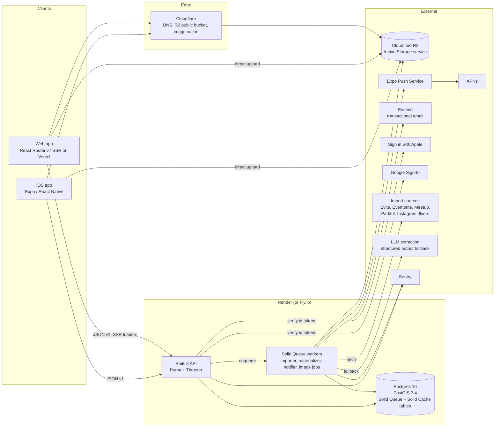
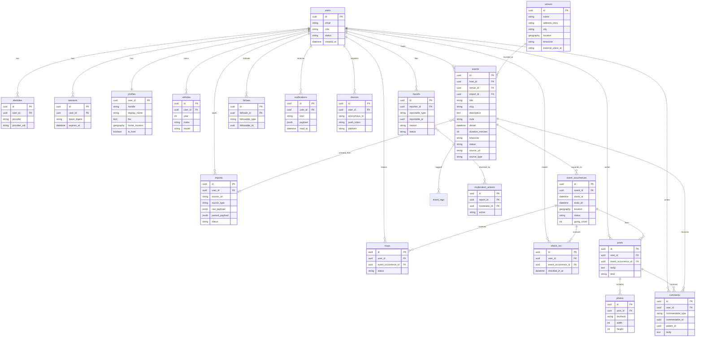

# Cars and Coffee Architecture

Status: planning draft, 2026-09-05. Owner: Amir. This document is the reference for how the system fits together. Decisions with trade-offs are recorded as ADRs in `docs/adr/` and linked from section 9.

Scope reminder: iOS first, web second, SoCal / Inland Empire launch, solo builder at 10 to 15 hours per week. Every choice below optimizes for a small surface area, boring infrastructure, and Rails doing the heavy lifting.

## Table of contents

1. System overview
2. Monorepo layout
3. Backend (Rails 8 API-only)
4. Web (React)
5. Mobile (Expo)
6. Shared packages
7. CI/CD
8. Security and privacy
9. ADR index

## 1. System overview

Three clients (iOS app, web app, and a thin importer surface inside both) talk to one Rails API over HTTPS/JSON. Rails owns all state: Postgres with PostGIS for data and geo, Solid Queue for background jobs (importer, occurrence materialization, notifications, image processing), Solid Cache for caching, and Active Storage backed by Cloudflare R2 for media. Push goes out through the Expo Push Service (APNs behind it), email through Resend.



### Request paths worth naming

| Path | Flow |
|---|---|
| Browse nearby | Client sends lat/lng/radius or a map bbox. Rails runs a PostGIS query on `event_occurrences`, returns a page of occurrences with denormalized event and venue summaries. No auth required. |
| Import from link | Client `POST /v1/imports` with a URL. Rails creates an `Import`, enqueues `ImportJob`, returns 202 with the import id. Job runs the adapter, writes `parsed_payload`, marks status. Client polls `GET /v1/imports/:id` (or receives a push) and opens the draft editor. |
| Publish event | Client `POST /v1/events` with the edited draft. Rails validates, geocodes if needed, stores the RRULE, and enqueues `MaterializeOccurrencesJob` which writes rows into `event_occurrences` for the next 8 weeks. |
| Photo post | Client requests a direct-upload signature, uploads to R2, then `POST /v1/posts` with the blob signed id. A job strips EXIF, generates variants, computes a blurhash. |
| Notification | A job fans out `Notification` rows for followers, then batches push tokens to Expo and emails to Resend. |

## 2. Monorepo layout

One repository, pnpm workspaces plus Turborepo. Rails lives inside the workspace as a package that pnpm installs nothing for and Turborepo orchestrates through npm scripts.

```
cars-and-coffee/
  .editorconfig
  .github/
    ISSUE_TEMPLATE/
      bug.yml
      feature.yml
      config.yml
    PULL_REQUEST_TEMPLATE.md
    workflows/
      ci.yml
  .gitignore
  .nvmrc                      # 22
  .ruby-version               # 3.3.x
  CLAUDE.md                   # conventions for Claude Code sessions
  CONTRIBUTING.md
  LICENSE                     # all rights reserved (private repo)
  README.md
  docker-compose.yml          # Postgres + PostGIS for local dev only
  package.json                # private root, scripts delegate to turbo
  pnpm-workspace.yaml
  turbo.json
  apps/
    api/                      # Rails 8 API-only (Ruby, not managed by pnpm)
      package.json            # scripts only: wraps bundle, rspec, rubocop
      turbo.json              # api-specific inputs/outputs
      Gemfile, config/, app/, db/, spec/ ...   (generated later by rails new)
    web/                      # React Router v7 framework mode, Vite, TypeScript
      package.json
      app/routes/ ...         (generated later)
    mobile/                   # Expo (latest SDK), Expo Router, TypeScript
      package.json
      app.config.ts, app/ ... (generated later)
  packages/
    api-client/               # typed fetch client, auth header injection, TanStack Query hooks
    types/                    # TS types generated from apps/api OpenAPI spec (do not hand edit)
    design-tokens/            # tokens.json source of truth, build emits TS + CSS vars
    ui/                       # cross-platform primitives (see 6.3 for the caveat)
    config/                   # shared eslint, prettier, tsconfig bases
  docs/
    README.md                 # index
    architecture.md           # this file
    data-model.md
    api.md
    importer.md
    local-development.md
    mobile-liquid-glass.md    # owned by the mobile workstream
    adr/
      0001-monorepo-tooling.md ... 0008-hosting.md
  tooling/                    # scripts shared across apps (openapi generation, token build)
```

### How Turborepo treats the Rails app

Turborepo has no Ruby awareness and does not need any. Its unit is a workspace package with a `package.json`, and a task is simply an npm script. `apps/api/package.json` declares scripts that wrap the Ruby toolchain:

```json
{
  "name": "@cac/api",
  "private": true,
  "scripts": {
    "dev": "bin/dev",
    "build": "bundle install && bin/rails db:prepare",
    "test": "bundle exec rspec",
    "lint": "bundle exec rubocop",
    "typecheck": "echo 'no typecheck for ruby' && exit 0",
    "openapi": "bundle exec rake rswag:specs:swaggerize"
  }
}
```

An `apps/api/turbo.json` extends the root config and declares Ruby-specific inputs so cache hashes change only when Ruby files, `Gemfile.lock`, or `db/` change, and it lists `swagger/v1/openapi.yaml` as an output so `packages/types` can depend on `@cac/api#openapi` through `dependsOn`. Test and lint tasks for api are marked `cache: false` in CI until we trust the input globs, because a stale cache hit on rspec is worse than a slow run.

### How pnpm ignores it

`pnpm-workspace.yaml` includes `apps/*`, so pnpm sees `apps/api` as a workspace package. Because that package has no `dependencies` or `devDependencies`, pnpm creates nothing under `apps/api/node_modules` and never touches the Gemfile. Ruby dependencies are installed by `bundle install` inside the api scripts. The only pnpm-visible artifact of the Rails app is the OpenAPI file it emits.

### Naming

All workspace packages are scoped `@cac/*`. Apps: `@cac/api`, `@cac/web`, `@cac/mobile`. Packages: `@cac/api-client`, `@cac/types`, `@cac/design-tokens`, `@cac/ui`, `@cac/config`.

## 3. Backend (Rails 8 API-only)

### 3.1 Gem choices

Generated with `rails new api --api --database=postgresql --skip-test` (RSpec replaces Minitest). Rails 8.1 is the target; the 8.x defaults (Solid Queue, Solid Cache, Propshaft, Thruster, Kamal) are kept where they apply to an API app.

| Concern | Choice | Why | Alternatives considered |
|---|---|---|---|
| CORS | `rack-cors` | Required for the web app on a different origin. | none |
| Serialization | `alba` | Fast, plain Ruby, inheritance and conditional attributes, no DSL magic. Pairs well with OpenAPI docs. | `jbuilder` (slower, view-template mental model), `blueprinter` (fine, less active) |
| Geo | `activerecord-postgis-adapter` 11.x + `rgeo` + `rgeo-geojson` | Supports ActiveRecord 8.0 and 8.1 as of v11.1. Mature, battle tested. | `seuros/activerecord-postgis` (cleaner design, Rails 8.1+, but early stage, revisit in 2027) |
| Auth | custom opaque session tokens + `jwt` for verifying Apple/Google id tokens | Devise is built around browser sessions and email/password; we have neither. Rails 8 `bin/rails generate authentication` is also cookie oriented. A small `Session` model is less code than fighting Devise. | `devise` + `devise-jwt`, `rodauth` |
| Authorization | `pundit` | Simple policy objects, one per resource. | `action_policy` |
| Pagination | `pagy` (keyset for feeds, offset for admin) | Fast, minimal, keyset support for cursor pagination. | `kaminari` |
| Jobs | `solid_queue` (Rails 8 default) | Postgres-backed, no Redis, one less service. Recurring jobs via `config/recurring.yml`. | `sidekiq` (needs Redis, better for very high throughput; not needed at our scale) |
| Cache | `solid_cache` (Rails 8 default) | Postgres-backed, same reasoning. | Redis |
| Media | `active_storage` + `aws-sdk-s3` pointed at Cloudflare R2 | R2 is S3 compatible with no egress fees, which matters for image-heavy feeds. | S3 |
| Image processing | `image_processing` + `ruby-vips` | vips is faster and leaner than ImageMagick. | ImageMagick |
| OpenAPI | `rswag` (rswag-specs, rswag-api) | Request specs double as the spec source, so docs cannot drift from tests. Emits `swagger/v1/openapi.yaml` consumed by `packages/types`. | `oas_rails` (annotation driven, newer, less proven), hand-written spec |
| Rate limiting | `rack-attack` | Throttle by IP and by token, block abusive importer usage. Backed by Solid Cache store. | Rails 8.1 built-in `rate_limit` (controller only, keep for specific actions) |
| Recurrence | `ice_cube` | RRULE parsing and expansion, well maintained. | `rrule` gem, hand rolled |
| Errors and tracing | `sentry-ruby`, `sentry-rails` | Free tier is enough. | Honeybadger, AppSignal |
| HTTP client (importer) | `faraday` + `faraday-retry` | Middleware for caching, retries, and logging. | `httpx` |
| HTML parsing | `nokogiri` | Standard. | none |
| OCR | external API (Google Vision or Apple Vision on device) | Server OCR is a fallback; iOS can run Vision on device for flyers. | `tesseract` |
| Testing | `rspec-rails`, `factory_bot_rails`, `faker`, `shoulda-matchers`, `webmock`, `vcr` | Standard Rails testing stack. VCR cassettes for importer adapters. | Minitest |
| Lint | `rubocop-rails-omakase` (Rails 8 default) + `rubocop-rspec` | Match Rails defaults, avoid style debates. | standardrb |
| Dev | `dotenv-rails`, `annotaterb`, `bullet`, `letter_opener` | Quality of life. | |

### 3.2 Data model

Full column-level definitions live in `docs/data-model.md`. The ERD:



Notes on shape:

| Decision | Reasoning |
|---|---|
| UUID primary keys everywhere | Safe to expose in URLs and deep links, no enumeration. `gen_random_uuid()` via `pgcrypto`, or UUIDv7 if Postgres 17+ is available on the host (better index locality). |
| `event_occurrences` denormalizes `location` and `starts_at` | Map and list queries hit one table with one composite index instead of joining events and venues on every request. A trigger or model callback keeps it in sync when a venue moves. |
| `rsvps`, `check_ins`, `posts` attach to an occurrence, not the event | A recurring Saturday meet is one `event` with many occurrences; "who is going this week" must be per occurrence. |
| `follows` is polymorphic | Users follow people and hosts today. Following a recurring event is a cheap extension. |
| `imports` keeps `raw_payload` | Re-parsing after an adapter fix does not require re-fetching, and it is the training corpus for improving extraction. Purged after 30 days. |
| `identities` separate from `users` | One user can link Apple and Google. Apple's private relay email is stored on the identity, not as the canonical email. |
| `devices` allows null `user_id` | Anonymous browsers get personalization (home area, recently viewed) keyed by a device id. Linking on sign-in is a single update. |

### 3.3 Key indexes

| Table | Index | Purpose |
|---|---|---|
| `venues` | `GIST (location)` | Venue proximity, dedupe on import. |
| `event_occurrences` | `GIST (location, starts_at)` using `btree_gist` | Single index for "near me, this weekend". |
| `event_occurrences` | `BTREE (starts_at) WHERE status = 'scheduled'` | List view sorted by date, materializer lookups. |
| `event_occurrences` | `BTREE (event_id, starts_at)` | Event detail "upcoming dates". |
| `events` | `GIN (tags)` on a `text[]` column | Vehicle theme filter. |
| `events` | `UNIQUE (slug)` | Shareable URLs. |
| `events` | `UNIQUE (source_url)` partial where not null | Prevents duplicate imports of the same Evite. |
| `rsvps` | `UNIQUE (user_id, event_occurrence_id)` | One RSVP per person per occurrence. |
| `follows` | `UNIQUE (follower_id, followable_type, followable_id)` | |
| `sessions` | `UNIQUE (token_digest)` | Token lookup. |
| `identities` | `UNIQUE (provider, provider_uid)` | |
| `imports` | `BTREE (status, created_at)` | Job queue style lookups and admin views. |
| `notifications` | `BTREE (user_id, read_at, created_at DESC)` | Inbox. |
| `comments` | `BTREE (commentable_type, commentable_id, created_at)` | |

### 3.4 Geo query design

All coordinates are stored as `geography(Point, 4326)`. Geography, not geometry, so distances are in meters without a projection step and `ST_DWithin` uses the spheroid.

Proximity (list view, feed):

```sql
SELECT o.*, ST_Distance(o.location, :origin) AS distance_m
FROM event_occurrences o
WHERE o.status = 'scheduled'
  AND o.starts_at BETWEEN :from AND :to
  AND ST_DWithin(o.location, :origin, :radius_m)
ORDER BY o.starts_at, distance_m
LIMIT :limit;
```

Map viewport (bounding box): `ST_Intersects(o.location, ST_MakeEnvelope(:west, :south, :east, :north, 4326)::geography)` with the same time filter. The map endpoint returns a slim payload (id, lat, lng, starts_at, title, going_count) capped at 500 points; if the box would exceed the cap, the API returns `truncated: true` and the client asks the user to zoom in or switches to server clusters.

Clustering recommendation: client-side with `supercluster` on both web and mobile. Reasoning: at launch scale (hundreds of occurrences in a region on a given weekend, low thousands statewide) the full bbox result fits comfortably in one response, supercluster is instant, and cluster expansion needs no round trip. Server-side `ST_ClusterDBSCAN` is kept as a documented upgrade path for the zoomed-out national view if the point cap starts triggering regularly. Do not build it now.

Home area for anonymous users: the client sends an approximate location (rounded to two decimals, roughly 1 km) as a query param. Precise location never needs to be sent for browsing.

### 3.5 Recurrence

Events store `rrule` (RFC 5545 string, for example `FREQ=WEEKLY;BYDAY=SA`), `dtstart` (in the venue's timezone, stored as UTC plus `timezone` column), `duration_minutes`, and optional `rrule_until`. One-off events have a null `rrule`.

`MaterializeOccurrencesJob` runs nightly (Solid Queue recurring) and on every event create/update. It uses `ice_cube` to expand the schedule from now to `now + 8.weeks`, upserts `event_occurrences` on `(event_id, starts_at)`, and marks occurrences past the new horizon or removed from the rule as `cancelled` (never hard deleted, because RSVPs may reference them). Hosts can cancel or edit a single occurrence; overrides live on the occurrence row and survive re-materialization because the upsert only touches rows whose `overridden_at` is null.

Why materialize rather than expand at query time: PostGIS plus time filters need a real column to index. Expanding RRULEs per request cannot use an index and makes "next Saturday near me" a scan.

### 3.6 API surface (v1)

Full reference draft in `docs/api.md`. Conventions:

| Convention | Value |
|---|---|
| Base | `https://api.carsandcoffee.app/v1` |
| Auth header | `Authorization: Bearer <session token>`; optional `X-Device-Id: <uuid>` on every request for anonymous personalization |
| Content | JSON, snake_case keys, ISO 8601 UTC timestamps with a separate `timezone` where display matters |
| Pagination | Cursor based: `?cursor=&limit=` returns `{ data: [...], meta: { next_cursor, has_more } }` |
| Errors | `{ error: { code: "not_found", message: "...", details: { field: ["msg"] } } }` with matching HTTP status; codes are stable strings clients can switch on |
| Versioning | Path prefix `/v1`. Breaking changes get `/v2`; additive changes do not bump. |
| Rate limits | `429` with `Retry-After`; limits differ for anonymous vs authenticated |

Endpoint list (A = anonymous allowed, U = user required, H = host or owner, M = moderator):

| Method | Path | Auth | Purpose |
|---|---|---|---|
| POST | `/auth/apple` | A | Exchange Apple identity token for a session |
| POST | `/auth/google` | A | Exchange Google id token for a session |
| DELETE | `/auth/session` | U | Sign out (revoke token) |
| GET | `/me` | U | Current user with profile |
| PATCH | `/me` | U | Update profile |
| DELETE | `/me` | U | Account deletion (App Store requirement) |
| POST | `/devices` | A | Register device and push token |
| GET | `/events` | A | Search: `near`, `bbox`, `from`, `to`, `tags`, `recurring`, `q` |
| GET | `/events/map` | A | Slim bbox payload for map pins |
| GET | `/events/:slug` | A | Event detail with next occurrences |
| POST | `/events` | U | Create (from manual form or import draft) |
| PATCH | `/events/:id` | H | Update |
| DELETE | `/events/:id` | H | Cancel |
| GET | `/events/:id/occurrences` | A | Upcoming occurrences |
| PATCH | `/occurrences/:id` | H | Override or cancel one occurrence |
| GET | `/occurrences/:id` | A | Occurrence detail (who's going, photos, comments) |
| PUT | `/occurrences/:id/rsvp` | U | Set RSVP status |
| DELETE | `/occurrences/:id/rsvp` | U | Remove RSVP |
| POST | `/occurrences/:id/check_in` | U | Check in (server validates time window and optional distance) |
| GET | `/occurrences/:id/posts` | A | Photos and posts from the meet |
| POST | `/posts` | U | Create post with photo blob ids |
| DELETE | `/posts/:id` | H | Delete own post |
| GET | `/:commentable/:id/comments` | A | Comments on event or post |
| POST | `/:commentable/:id/comments` | U | Comment |
| DELETE | `/comments/:id` | H | Delete own comment |
| GET | `/feed` | A | Nearby upcoming + followed activity (anonymous gets nearby only) |
| GET | `/users/:handle` | A | Public profile, garage, hosted events |
| GET | `/users/:handle/events` | A | Events hosted |
| PUT | `/follows` | U | Follow user or event |
| DELETE | `/follows` | U | Unfollow |
| GET | `/me/vehicles` | U | Garage |
| POST | `/me/vehicles` | U | Add vehicle |
| PATCH | `/me/vehicles/:id` | U | Update |
| DELETE | `/me/vehicles/:id` | U | Remove |
| POST | `/imports` | U | Start import from URL or flyer image |
| GET | `/imports/:id` | U | Poll status and draft |
| POST | `/uploads/direct` | U | Active Storage direct upload signature |
| GET | `/notifications` | U | Inbox |
| PATCH | `/notifications/:id` | U | Mark read |
| POST | `/reports` | U | Report content |
| GET | `/venues/search` | A | Venue autocomplete (proxy to Apple/Google places with caching) |
| GET | `/health` | A | Liveness |
| GET | `/openapi.yaml` | A | Spec |

Anonymous browse is a product principle, so every read endpoint for public content is anonymous. The API never requires an account to view an event page, which also lets the web SSR loader fetch without a token.

### 3.7 Importer pipeline

The signature feature. Deep detail in `docs/importer.md`; the shape:

```
POST /v1/imports { source_url | flyer_blob_id }
  -> Import.create(status: "queued")
  -> ImportJob.perform_later(import.id)
       -> Importers::Registry.for(url)            # picks adapter by host/pattern
       -> adapter.fetch  (Faraday, cached, rate limited, robots checked)
       -> adapter.parse  -> Importers::DraftEvent  (normalized, per-field confidence)
       -> if low confidence or adapter missing fields:
            Importers::LlmExtractor.extract(html_text, hints) -> DraftEvent (structured output)
            merge: adapter fields win when confidence >= 0.8, else LLM
       -> geocode venue if only an address string is present
       -> import.update(parsed_payload:, status: "ready")
       -> push "Your draft is ready" if the client is backgrounded
  <- client polls GET /v1/imports/:id or receives push
  -> user edits draft in the event form, POST /v1/events { import_id, ...fields }
```

Adapter interface (Ruby sketch):

```ruby
module Importers
  DraftEvent = Data.define(
    :title, :description, :starts_at, :ends_at, :timezone, :rrule,
    :venue_name, :address, :lat, :lng, :host_name, :cover_image_url,
    :source_url, :source_type, :confidence  # Hash of field => 0.0..1.0
  )

  class BaseAdapter
    # Return true if this adapter should handle the URL.
    def self.matches?(uri) = raise NotImplementedError

    # Lower is tried first when several adapters match.
    def self.priority = 100

    def initialize(import) = @import = import

    # Fetch the source. Returns a Fetched struct { body:, content_type:, final_url:, fetched_at: }.
    # Default uses Importers::Fetcher (Faraday with cache, retry, robots, per-host throttle).
    def fetch = Fetcher.get(@import.source_url, adapter: self.class)

    # Parse into a DraftEvent. Must never raise on missing fields; use nil plus low confidence.
    def parse(fetched) = raise NotImplementedError

    # Whether the LLM fallback is allowed for this source (false for sources whose ToS forbid it).
    def llm_fallback_allowed? = true
  end

  class Registry
    ADAPTERS = [
      EviteAdapter, EventbriteAdapter, MeetupAdapter, PartifulAdapter,
      InstagramAdapter, FlyerOcrAdapter, GenericOgAdapter  # generic last
    ].freeze

    def self.for(source)
      uri = URI.parse(source.to_s)
      ADAPTERS.select { |a| a.matches?(uri) }.min_by(&:priority) || GenericOgAdapter
    end
  end
end
```

Adapter notes:

| Adapter | Strategy | Risk |
|---|---|---|
| Evite | HTML plus embedded JSON state on the invite page; schema.org `Event` when present. | Login-gated invites return nothing; tell the user to make it public or paste details. |
| Eventbrite | Public API (needs app token) or JSON-LD on the page. Prefer API. | Rate limits, easy. |
| Meetup | JSON-LD on public event pages; GraphQL API requires OAuth and partner approval. Use JSON-LD. | Moderate. |
| Partiful | Public event pages have Next.js data and OG tags. | Markup changes without notice; LLM fallback covers it. |
| Instagram | OG tags only for public posts; caption text goes to LLM. Do not log in, do not scrape beyond OG. | ToS is strict. We fetch one public page per user request, no crawling. Flag in the UI that Instagram imports are best effort. |
| Facebook Events | Not attempted server-side (blocked without login). User pastes text or screenshots into the flyer path. | Deferred. |
| Flyer OCR | On-device Vision OCR on iOS produces text; server receives text plus the image and runs LLM extraction. Server OCR (Google Vision) is the web fallback. | Cost per call, low volume. |
| Generic OG | OpenGraph, schema.org `Event`, `<title>`, visible text. Always the last resort before LLM. | none |

Cross-cutting rules:

| Concern | Rule |
|---|---|
| Caching | `Fetcher` caches by normalized URL for 6 hours in Solid Cache. A second user importing the same Evite gets the cached body. |
| Rate limits | Per-host token bucket in Solid Cache (default 1 request per 2 seconds per host, 60 per hour). Per-user limit of 20 imports per hour via rack-attack. |
| robots and ToS | `Fetcher` checks `robots.txt` for the adapter's user agent and refuses disallowed paths, except for adapters flagged `user_initiated_single_fetch` where we fetch exactly the page the user pasted, once, identified by a real user agent string with a contact URL. No crawling, no pagination, no login. |
| Confidence | Every field carries 0.0 to 1.0. Structured sources (JSON-LD, API) score 0.95. Regex over visible text scores 0.5 to 0.7. LLM output scores whatever the model reports, capped at 0.85. The client highlights fields under 0.7 for review. |
| Retention | `raw_payload` purged after 30 days; `parsed_payload` kept with the event for provenance. |
| Idempotency | `POST /imports` with a URL already imported by the same user in the last hour returns the existing import. |
| Timeouts | Fetch 10 s, parse 5 s, LLM 20 s. Whole job 60 s hard limit, then `status: failed` with a user-readable `error_code`. |

### 3.8 Auth

| Piece | Design |
|---|---|
| Sign in with Apple | Client gets an identity token via `expo-apple-authentication` (iOS) or Apple JS (web). Server verifies signature against Apple's JWKS (cached 24 h), checks `iss`, `aud` (our bundle id or service id), `exp`, and `nonce`. Finds or creates `identities(provider: 'apple', provider_uid: sub)`. |
| Google | Client gets an id token via `@react-native-google-signin/google-signin` or Google Identity Services on web. Server verifies against Google's JWKS with the same checks. |
| Sessions | Server issues a random 32-byte token, stores `SHA256(token)` in `sessions.token_digest` with `expires_at` (90 days, sliding), `device_id`, `last_seen_at`. Clients store it in Keychain (`expo-secure-store`) or an httpOnly cookie set by the web SSR server. Revocation is a row delete. No JWT for sessions; opaque tokens are simpler to revoke and rotate. |
| Anonymous | Clients generate a UUID on first launch and send `X-Device-Id`. Used for push registration before sign-in, "recently viewed", and home area. On sign-in, the device row is linked to the user. |
| Account linking | If an Apple identity signs in with an email matching an existing Google-only user (Apple email verified, not relay), link identities rather than creating a duplicate. Otherwise create a new user. |
| Deletion | `DELETE /me` schedules a job that anonymizes posts and comments, deletes RSVPs and follows, and revokes the Apple token via Apple's revoke endpoint (required by App Store Review Guideline 5.1.1(v)). |

### 3.9 Notifications

| Channel | Design |
|---|---|
| Push | Expo Push Service via the `exponent-server-sdk` gem. One `NotificationDeliveryJob` batches up to 100 tokens per request, handles `DeviceNotRegistered` receipts by deleting the token. Direct APNs (`apnotic`) is the documented fallback if Expo's service becomes a bottleneck or we need notification extensions. |
| Email | Resend via the `resend` gem and Action Mailer. Transactional only at launch: welcome, weekly digest (opt-in), event cancelled. |
| In-app | `notifications` table drives the inbox and the badge count. Push and email are projections of the same rows. |
| Triggers | New event within a user's home radius (batched hourly, at most one per day), host you follow published an event, occurrence starting in 24 h and 2 h for RSVPs, comment on your event or post, new follower. Each kind has a user preference toggle. |

### 3.10 Observability

Sentry for exceptions and performance traces (Rails and jobs, plus Expo and web SDKs with the same DSN family). Rails structured logging via `lograge` to stdout, shipped by the host. Solid Queue's dashboard via `mission_control-jobs` mounted at `/admin/jobs` behind moderator auth. `GET /health` checks DB and queue lag. Uptime ping from a free external monitor. No metrics stack at launch; add later if needed.

### 3.11 Environments and deployment

| Env | Where | Notes |
|---|---|---|
| development | Laptop | Postgres+PostGIS in Docker Compose, Rails on host, Expo dev build on device. |
| test | CI | Postgres service container with PostGIS image. |
| staging | Render (web service + worker + Postgres), TestFlight build pointing here | Optional until launch; can be skipped early to save money. |
| production | Render | `api` web service, `worker` background service running `bin/jobs`, managed Postgres with PostGIS extension enabled, cron via Solid Queue recurring. |

Render is the recommendation (ADR 0008): managed Postgres supports PostGIS with `CREATE EXTENSION`, background workers and cron are first class, blueprints (`render.yaml`) keep it declarative, and there is no Dockerfile or VM to babysit. Fly.io is the alternative if we later want multi-region or lower cost; Fly Managed Postgres also supports PostGIS. Kamal (the Rails 8 default) is intentionally not used at launch because it needs a VPS to manage.

Dockerfile expectations: Rails 8 generates a production `Dockerfile` (multi-stage, `jemalloc`, Thruster in front of Puma). Keep it, add `libvips` and `postgis` client libs to the runtime stage. Render can build from it directly, so the same image works if we move to Fly.

Backups: Render managed Postgres daily snapshots (7 day retention on the starter tier). Add a weekly `pg_dump` job to R2 for off-platform copies. R2 bucket versioning on for media.

Config: 12-factor env vars. `config/credentials` is not used, because host dashboards are the source of truth; `dotenv` locally.

## 4. Web (React)

### 4.1 Framework recommendation

React Router v7 in framework mode (the Remix lineage) with SSR, built by Vite, deployed to Vercel with the `@vercel/react-router` preset. See ADR 0005.

Why not Next.js: the web app is a secondary surface whose main jobs are SEO-crawlable event pages, OG cards for shared links, and a usable browse experience. React Router v7 gives SSR loaders, streaming, meta exports for OG tags, and file-based routes with a much smaller conceptual surface than the App Router (no RSC, no server actions, no caching semantics to learn). It shares React Native's routing vocabulary (Expo Router is built on React Navigation, but the loader and route mental model transfers). Vite build and dev are fast and the same Vite config feeds `packages/ui` tests. Lock-in is low: the loaders call our Rails API, so moving to Next.js later means rewriting routes, not data access.

When Next.js would win: heavy image optimization needs, an eventual marketing site with MDX, or a team that already knows it. None apply.

### 4.2 Routes

| Route | Loader | SEO |
|---|---|---|
| `/` | Nearby upcoming (IP geolocation via Vercel header, fallback to Inland Empire) | Index page |
| `/meets` | Search with query params (`near`, `from`, `tags`) | Indexable with canonical |
| `/meets/:slug` | Event detail, next occurrences, photos | Primary SEO target. `meta` export emits title, description, `og:image`, `og:type=event`, JSON-LD `Event` with `eventSchedule` for recurring meets. |
| `/meets/:slug/:occurrenceId` | Single date | Canonical points at the event unless the occurrence is overridden |
| `/map` | Client-only map with bbox fetch | noindex |
| `/u/:handle` | Profile, garage, hosted events | Indexable |
| `/new` | Create or import (auth required, client-side) | noindex |
| `/imports/:id` | Draft editor | noindex |
| `/sign-in` | Apple JS and Google Identity Services | noindex |
| `/og/meets/:slug.png` | Resource route rendering the share card (Satori or `@vercel/og`) | Served as `og:image` |
| `/sitemap.xml`, `/robots.txt` | Resource routes | |

### 4.3 OG cards and share links

Every event has one canonical URL `https://carsandcoffee.app/meets/:slug`. The mobile app shares that URL; universal links (`apple-app-site-association`) open it in the app when installed. The OG image route renders a 1200x630 card (title, date, venue, cover photo, brand mark) and caches it at the edge for 1 hour. iMessage and Instagram unfurl from those tags.

### 4.4 Maps

MapLibre GL JS with a free tile source (OpenFreeMap or MapTiler free tier) on web; `react-native-maps` with Apple Maps on iOS (no key, native look, fits Liquid Glass). Both consume the same `/events/map` payload and the same `supercluster` wrapper in `packages/ui/map` (logic only, rendering differs).

### 4.5 Shared api-client

`packages/api-client` exports a `createClient({ baseUrl, getToken, getDeviceId })` and TanStack Query hooks (`useNearbyEvents`, `useEvent`, `useImport`). The web loaders call the raw client server-side; components use the hooks client-side. Mobile uses the hooks only.

## 5. Mobile (Expo)

Summary only; the mobile workstream owns `docs/mobile-liquid-glass.md` and the deep design.

| Topic | Decision |
|---|---|
| SDK | Latest Expo SDK (54 at time of writing; move to 55 when stable), New Architecture on, Expo Router for file-based navigation, development builds (not Expo Go) because of native modules for maps, Apple auth, and glass effects. |
| Language | TypeScript strict, shared `@cac/config` tsconfig. |
| Styling | Design tokens from `@cac/design-tokens`; styling library choice (NativeWind vs Unistyles) is the mobile workstream's call, tokens support both. |
| iOS 26 | Liquid Glass via `expo-glass-effect` and native tab bars where the SDK exposes them. Custom glass fallbacks on iOS < 26. |
| Data | `@cac/api-client` hooks, TanStack Query with persisted cache for offline browse of recently loaded meets. |
| Auth | `expo-apple-authentication`, Google sign-in native module, tokens in `expo-secure-store`. |
| Push | `expo-notifications`, token registered via `POST /devices`. |
| Location | `expo-location` with "when in use" only. Coarse for browse, precise only for check-in (and only at the moment of check-in). |
| Import | Share extension (via `expo-share-intent` or a config plugin) so a user can share an Evite link from Safari or Instagram straight into a draft. Flyer OCR uses on-device Vision through a small native module or `expo-image-manipulator` plus a server call. |
| Builds | EAS Build and EAS Submit, triggered by CI on version tags; EAS Update for JS-only fixes on the production channel. |

## 6. Shared packages

### 6.1 OpenAPI to TypeScript

```
apps/api rswag request specs
  -> bundle exec rake rswag:specs:swaggerize
  -> apps/api/swagger/v1/openapi.yaml           (committed, reviewed in PRs)
  -> pnpm --filter @cac/types generate
       openapi-typescript openapi.yaml -o src/generated.d.ts
  -> packages/types exports paths, components, and helper aliases (Event, Occurrence, ...)
  -> packages/api-client uses openapi-fetch for a typed client with zero runtime schema
```

Turborepo wires `@cac/types#generate` to depend on `@cac/api#openapi`, and `@cac/api-client#build` to depend on `^build`, so `pnpm turbo build` regenerates types when the spec changes. The generated file is committed so that web and mobile CI do not need Ruby. A CI check runs the generation and fails if the committed file is stale.

### 6.2 Design tokens

`packages/design-tokens/tokens.json` is the source of truth, written in the W3C Design Tokens Community Group format (`$value`, `$type`), populated by the brand workstream. A small build script (Style Dictionary v4, or a 60-line custom script if Style Dictionary feels heavy) emits:

| Output | Consumer |
|---|---|
| `dist/tokens.ts` (typed object) | Mobile (NativeWind theme or Unistyles theme), web components |
| `dist/tokens.css` (custom properties, light and dark) | Web global stylesheet |
| `dist/tailwind.theme.js` | NativeWind and web Tailwind config if used |

Tokens cover color (semantic, not raw), spacing scale, radii, typography (family, size, line height, weight), elevation, and glass material parameters for iOS 26 (blur radius, tint alpha) so the web can echo the look without native glass.

### 6.3 Shared UI (`packages/ui`)

Feasible but bounded. Truly shared code is logic and tokens, not pixels: the `supercluster` wrapper, date and recurrence formatting (`formatOccurrence`, `describeRrule`), distance formatting, share URL builders, and a small set of headless components (hooks that return state and handlers, no JSX). Rendering primitives are not shared at launch: iOS uses native Liquid Glass components and web uses HTML, and react-native-web adds weight and fights SSR for little gain on a two-surface product. If the visual overlap grows, `react-strict-dom` is the path to revisit, not react-native-web.

### 6.4 Config (`packages/config`)

`eslint` flat config (typescript-eslint, react, react-hooks, import ordering, no default exports outside routes), `prettier` config, and `tsconfig.base.json` (strict, `moduleResolution: bundler`, path alias `@cac/*`). Rails keeps its own `rubocop` config.

## 7. CI/CD

GitHub Actions, one workflow with per-app jobs gated by `paths` filters so a mobile-only PR does not run rspec. Turborepo remote cache (Vercel's free tier) is optional and off by default; turn it on if pnpm builds exceed a few minutes.

| Job | Trigger | Steps |
|---|---|---|
| `api` | changes under `apps/api/**` | Ruby 3.3 setup with bundler cache, Postgres service `postgis/postgis:16-3.4`, `db:prepare`, `rubocop`, `rspec`, upload `openapi.yaml` artifact, fail if committed spec is stale |
| `web` | `apps/web/**`, `packages/**` | pnpm install with cache, `turbo lint typecheck test build --filter=@cac/web...` |
| `mobile` | `apps/mobile/**`, `packages/**` | pnpm install, `turbo lint typecheck test --filter=@cac/mobile...`; no native build on PRs |
| `packages` | `packages/**` | `turbo lint typecheck test build --filter='./packages/*'` |
| `eas-build` | tag `mobile-v*` | `eas build --platform ios --profile production --non-interactive`, then `eas submit` to TestFlight |
| `deploy-web` | Vercel Git integration, not Actions | Preview per PR, production on `main` |
| `deploy-api` | Render Git integration, not Actions | Auto deploy on `main` after CI passes (Render waits for checks) |

Commit convention: Conventional Commits (`feat:`, `fix:`, `chore:`, `docs:`) with optional scope (`feat(api): ...`). No changesets; nothing is published to npm, and app versions are bumped by hand in `app.config.ts` and the Rails `VERSION` constant. Squash merge to `main`, branch protection with CI required.

## 8. Security and privacy

| Area | Practice |
|---|---|
| Location | Browse uses coarse location (2 decimal rounding client-side before sending). Precise location is requested only for check-in, sent once, and stored only as a boolean `verified` plus distance bucket, never raw coordinates. Profile `home_location` is an optional coarse point the user sets, not GPS. Photos have GPS EXIF stripped before storage. |
| PII minimization | Store email, display name, handle, avatar. No phone numbers, no birthdate, no contacts upload. Apple relay emails are respected (never asked to reveal). Analytics events carry device id, not email. |
| Images | `image_processing` pipeline strips all EXIF (`strip: true` in vips), generates variants, computes blurhash. Original is replaced by the stripped version, not kept. |
| Content moderation | User reports on events, posts, comments, profiles with reason codes. Three reports auto-hide pending review. Moderator role sees a queue at `/admin/reports` (Rails admin views, not exposed to public API). Block user (hides their content from you). App Store requires block and report for UGC, both ship in v1. Optional automated image screening (AWS Rekognition or a small classifier) later. |
| Rate limiting | rack-attack: anonymous 60 req/min per IP, authenticated 300 req/min per token, imports 20/hour per user, auth endpoints 10/min per IP. |
| Auth hygiene | Opaque tokens hashed at rest, 90 day sliding expiry, revoke on sign-out and on password-less account events (identity unlink). Apple and Google JWKS cached with kid rotation handling. |
| Transport | HTTPS only, HSTS, CORS locked to web origins, `X-Device-Id` is not a secret and grants nothing beyond personalization. |
| Secrets | Host dashboards and GitHub environment secrets. `.env` files are gitignored. No credentials.yml.enc in the repo. |
| Data deletion | In-app account deletion, 30 day soft delete then purge job. Import raw payloads purged at 30 days. |
| App Store privacy labels | Data linked to you: email, name, user id, photos (user content), coarse location (app functionality). Data not linked: crash data, usage data (Sentry, anonymized). No tracking, no ads SDKs, so no ATT prompt. Fill the label from this table and keep it in sync when adding SDKs. |
| Importer | Never fetch login-gated pages, never store credentials for third-party sites, honor robots for non-user-initiated fetches, identify with a real user agent and contact address. |

## 9. ADR index

| ADR | Title | Status |
|---|---|---|
| [0001](adr/0001-monorepo-tooling.md) | Monorepo with pnpm workspaces and Turborepo | Accepted |
| [0002](adr/0002-rails-api-only.md) | Rails 8 API-only backend with Solid Queue and Solid Cache | Accepted |
| [0003](adr/0003-postgis-geo.md) | PostGIS geography with materialized occurrences | Accepted |
| [0004](adr/0004-expo-react-native.md) | Expo and React Native for mobile | Accepted |
| [0005](adr/0005-web-framework.md) | React Router v7 framework mode over Next.js | Proposed, confirm |
| [0006](adr/0006-auth-strategy.md) | Apple and Google sign-in with opaque session tokens | Accepted |
| [0007](adr/0007-importer-architecture.md) | Pluggable importer with LLM fallback | Accepted |
| [0008](adr/0008-hosting.md) | Render for API and Postgres, Vercel for web, R2 for media | Proposed, confirm |

Related docs: `data-model.md`, `api.md`, `importer.md`, `local-development.md`, `mobile-liquid-glass.md` (mobile workstream).
