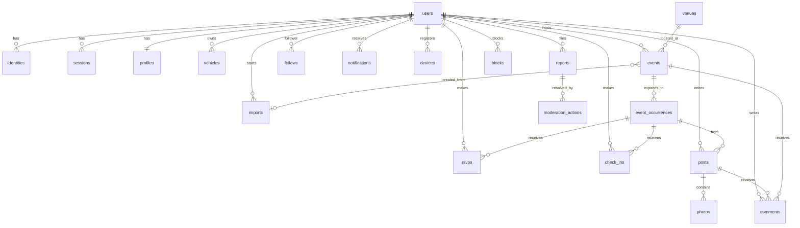

# Data Model

Status: planning draft, 2026-09-05. Companion to `architecture.md` section 3.2. Column types are Postgres types as they will appear in Rails migrations. All tables have `id uuid` primary keys (`gen_random_uuid()`), `created_at`, and `updated_at` unless noted.

Extensions required: `postgis`, `pgcrypto`, `btree_gist`, `pg_trgm` (handle and title search), `citext` (case-insensitive handles and emails).

## ERD

## Identity and access

### users

| Column | Type | Notes |
|---|---|---|
| email | citext, nullable, unique | Canonical email. Null when Apple relay is the only address and user hides email. |
| role | text, default `member` | `member`, `moderator`, `admin`. |
| status | text, default `active` | `active`, `suspended`, `deleted`. |
| deleted_at | timestamptz | Soft delete marker; purge job hard deletes after 30 days. |
| last_seen_at | timestamptz | |

### identities

| Column | Type | Notes |
|---|---|---|
| user_id | uuid FK | |
| provider | text | `apple`, `google`. |
| provider_uid | text | Apple `sub` or Google `sub`. |
| email | citext | Email reported by the provider (may be Apple relay). |
| email_verified | boolean | |
| raw_claims | jsonb | Last verified claims, for debugging. |

Unique `(provider, provider_uid)`.

### sessions

| Column | Type | Notes |
|---|---|---|
| user_id | uuid FK | |
| device_id | uuid FK, nullable | Links to `devices`. |
| token_digest | text, unique | SHA256 of the opaque token. Raw token is never stored. |
| expires_at | timestamptz | 90 days, refreshed on use when under 30 days remain. |
| last_used_at | timestamptz | |
| ip | inet | Last IP. |
| user_agent | text | |

### devices

| Column | Type | Notes |
|---|---|---|
| user_id | uuid FK, nullable | Null for anonymous devices. |
| anonymous_id | uuid, unique | Client-generated `X-Device-Id`. |
| platform | text | `ios`, `android`, `web`. |
| push_token | text, nullable | Expo push token. |
| push_enabled | boolean | |
| app_version | text | |
| home_location | geography(Point,4326), nullable | Coarse. |
| last_seen_at | timestamptz | |

### profiles

One row per user, `user_id` is the primary key.

| Column | Type | Notes |
|---|---|---|
| handle | citext, unique | 3 to 24 chars, `[a-z0-9_]`. |
| display_name | text | |
| bio | text | 280 chars. |
| avatar (Active Storage) | | One attachment. |
| home_location | geography(Point,4326), nullable | User-set coarse point. |
| home_label | text | "Fontana, CA". |
| is_host | boolean | Set true after first published event; drives host badge. |
| links | jsonb | `{ instagram: "...", website: "..." }`. |
| notification_prefs | jsonb | Per-kind toggles. |

### blocks

| Column | Type |
|---|---|
| blocker_id | uuid FK users |
| blocked_id | uuid FK users |

Unique `(blocker_id, blocked_id)`.

## Garage

### vehicles

| Column | Type | Notes |
|---|---|---|
| user_id | uuid FK | |
| year | integer | |
| make | text | |
| model | text | |
| trim | text | |
| nickname | text | |
| color | text | |
| description | text | |
| is_primary | boolean | |
| position | integer | Order in garage. |
| photos (Active Storage) | | Many attachments. |

## Places and events

### venues

| Column | Type | Notes |
|---|---|---|
| name | text | |
| address_line1 | text | |
| address_line2 | text | |
| city | text | |
| region | text | State code. |
| postal_code | text | |
| country | text | ISO 3166-1 alpha-2. |
| location | geography(Point,4326) | Required. |
| timezone | text | IANA, derived from location. |
| external_place_id | text, nullable | Apple MapKit or Google place id. |
| external_source | text | `apple`, `google`, `manual`. |
| created_by_id | uuid FK users | |

Indexes: `GIST (location)`, `BTREE (external_source, external_place_id)`. Dedupe rule on import: same name within 100 m.

### events

| Column | Type | Notes |
|---|---|---|
| host_id | uuid FK users | |
| venue_id | uuid FK venues | |
| import_id | uuid FK imports, nullable | Provenance. |
| title | text | |
| slug | text, unique | `<kebab-title>-<6 char suffix>`. |
| description | text | Markdown subset. |
| cover (Active Storage) | | One attachment. |
| dtstart | timestamptz | First occurrence start (UTC). |
| duration_minutes | integer | |
| timezone | text | Copied from venue at create; editable. |
| rrule | text, nullable | RFC 5545. Null means one-off. |
| rrule_until | timestamptz, nullable | |
| tags | text[] | `jdm`, `euro`, `exotic`, `classic`, `muscle`, `truck`, `ev`, `bike`, `all`. |
| status | text | `draft`, `published`, `cancelled`. |
| visibility | text | `public`, `unlisted`. |
| source_url | text, nullable | Link out to the original (Evite, Instagram). |
| source_type | text, nullable | Adapter name. |
| external_host_name | text | Host name from import when not a platform user. |
| capacity | integer, nullable | |
| rsvp_mode | text | `open`, `count_only`, `off`. |
| published_at | timestamptz | |
| occurrences_count | integer | Counter cache. |

Indexes: `UNIQUE (slug)`, `GIN (tags)`, `BTREE (host_id, status)`, `UNIQUE (source_url) WHERE source_url IS NOT NULL`, `GIN (title gin_trgm_ops)` for search.

### event_occurrences

| Column | Type | Notes |
|---|---|---|
| event_id | uuid FK events | |
| starts_at | timestamptz | |
| ends_at | timestamptz | |
| location | geography(Point,4326) | Denormalized from venue. |
| status | text | `scheduled`, `cancelled`, `completed`. |
| overridden_at | timestamptz, nullable | Set when host edits this occurrence; materializer skips it. |
| override_note | text | "Moved to the back lot this week". |
| going_count | integer | Counter cache. |
| interested_count | integer | Counter cache. |
| check_in_count | integer | Counter cache. |
| photos_count | integer | Counter cache. |

Indexes: `UNIQUE (event_id, starts_at)`, `GIST (location, starts_at)` with `btree_gist`, `BTREE (starts_at) WHERE status = 'scheduled'`.

## Participation

### rsvps

| Column | Type | Notes |
|---|---|---|
| user_id | uuid FK | |
| event_occurrence_id | uuid FK | |
| status | text | `going`, `interested`, `not_going`. |
| vehicle_id | uuid FK, nullable | "Bringing the NSX". |

Unique `(user_id, event_occurrence_id)`.

### check_ins

| Column | Type | Notes |
|---|---|---|
| user_id | uuid FK | |
| event_occurrence_id | uuid FK | |
| checked_in_at | timestamptz | |
| verified | boolean | Server was given a location within 500 m during the window. Raw coordinates are not stored. |
| distance_bucket | text | `on_site`, `nearby`, `remote`, `unknown`. |

Unique `(user_id, event_occurrence_id)`.

## Content

### posts

| Column | Type | Notes |
|---|---|---|
| user_id | uuid FK | |
| event_occurrence_id | uuid FK, nullable | Null for garage or profile posts. |
| kind | text | `photo`, `text`. |
| body | text | 1000 chars. |
| status | text | `visible`, `hidden`, `removed`. |
| comments_count | integer | |
| likes_count | integer | Likes are a v1.1 feature; column reserved. |

### photos

| Column | Type | Notes |
|---|---|---|
| post_id | uuid FK | |
| image (Active Storage) | | Original replaced with stripped version. |
| width | integer | |
| height | integer | |
| blurhash | text | |
| position | integer | |
| vehicle_id | uuid FK, nullable | Tag your car in the photo. |

### comments

| Column | Type | Notes |
|---|---|---|
| user_id | uuid FK | |
| commentable_type | text | `Event`, `Post`. |
| commentable_id | uuid | |
| parent_id | uuid FK comments, nullable | One level of replies. |
| body | text | 500 chars. |
| status | text | `visible`, `hidden`, `removed`. |

Index `(commentable_type, commentable_id, created_at)`.

### follows

| Column | Type | Notes |
|---|---|---|
| follower_id | uuid FK users | |
| followable_type | text | `User`, `Event`. |
| followable_id | uuid | |

Unique `(follower_id, followable_type, followable_id)`. Index `(followable_type, followable_id)` for follower counts and fan-out.

## Notifications

### notifications

| Column | Type | Notes |
|---|---|---|
| user_id | uuid FK | |
| kind | text | `event_nearby`, `host_published`, `reminder_24h`, `reminder_2h`, `comment`, `new_follower`, `import_ready`, `event_cancelled`. |
| payload | jsonb | Ids and display strings, enough to render without joins. |
| read_at | timestamptz | |
| pushed_at | timestamptz | |
| emailed_at | timestamptz | |

Index `(user_id, read_at, created_at DESC)`.

## Importer

### imports

| Column | Type | Notes |
|---|---|---|
| user_id | uuid FK | |
| source_url | text, nullable | Null for flyer imports. |
| source_type | text | Adapter name, set after registry match. |
| flyer (Active Storage) | | Optional image. |
| ocr_text | text | Client-provided or server OCR output. |
| raw_payload | jsonb | Fetched body metadata and extracted JSON (purged at 30 days). |
| parsed_payload | jsonb | `DraftEvent` as JSON with `confidence` map. |
| status | text | `queued`, `fetching`, `parsing`, `extracting`, `ready`, `failed`, `published`. |
| error_code | text | `login_required`, `not_found`, `blocked_by_robots`, `unsupported`, `timeout`, `parse_failed`. |
| error_message | text | |
| used_llm | boolean | |
| duration_ms | integer | |
| event_id | uuid FK, nullable | Set on publish. |

Index `(user_id, created_at DESC)`, `(status, created_at)`.

## Moderation

### reports

| Column | Type | Notes |
|---|---|---|
| reporter_id | uuid FK users | |
| reportable_type | text | `Event`, `Post`, `Comment`, `User`. |
| reportable_id | uuid | |
| reason | text | `spam`, `harassment`, `inappropriate`, `not_a_car_meet`, `wrong_info`, `other`. |
| details | text | |
| status | text | `open`, `reviewed`, `dismissed`, `actioned`. |

Index `(reportable_type, reportable_id, status)`. Three open reports on one object auto-hide it.

### moderation_actions

| Column | Type | Notes |
|---|---|---|
| report_id | uuid FK, nullable | |
| moderator_id | uuid FK users | |
| target_type | text | |
| target_id | uuid | |
| action | text | `hide`, `remove`, `restore`, `warn_user`, `suspend_user`, `dismiss`. |
| note | text | |

## Solid Queue and Solid Cache

Both live in the primary database at launch (single Postgres instance keeps cost down). Rails 8 generates `db/queue_schema.rb` and `db/cache_schema.rb`; point `config/database.yml` `queue` and `cache` at the same database until load says otherwise.

## Retention summary

| Data | Retention |
|---|---|
| `imports.raw_payload` | 30 days |
| Soft-deleted users | 30 days then purge |
| `sessions` past `expires_at` | Nightly sweep |
| `notifications` | 90 days |
| `event_occurrences` in the past | Kept (history for photos and check-ins) |
