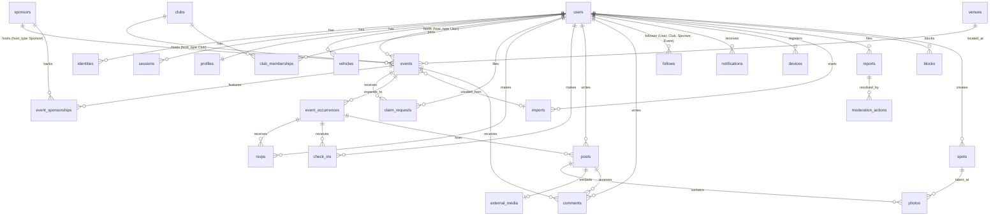

# Data Model

Status: planning draft v0.3, 2026-09-06 (v0.2 was 2026-09-05). Companion to `architecture.md` section 3.2. Column types are Postgres types as they will appear in Rails migrations. All tables have `id uuid` primary keys (`gen_random_uuid()`), `created_at`, and `updated_at` unless noted. This document is the source of truth for tables and columns; the ERD in `architecture.md` is a summary.

v0.3 adds the polymorphic event host (ADR 0010), clubs and memberships, sponsors and event sponsorships, claim requests, spots (photo locations), and external media for Instagram posts (ADR 0011). Follows now cover users, clubs, sponsors, and events.

Extensions required: `postgis`, `pgcrypto`, `btree_gist`, `pg_trgm` (handle, title, and name search), `citext` (case-insensitive handles and emails).

## ERD

## Host types

An event's host is one of three entities. The same shape (`type`, `id`, `slug` or `handle`, `name`, `avatar_url`, `verified`) is exposed everywhere a host appears.

| `host_type` | Table | Slug field | Managed by |
|---|---|---|---|
| `User` | `users` plus `profiles` | `profiles.handle` | The user, in the app |
| `Club` | `clubs` | `clubs.slug` | Admin UI at launch; club owners and admins in the app and on the web after launch |
| `Sponsor` | `sponsors` | `sponsors.slug` | Admin UI only until self-service is built |

`follows.followable_type` accepts all three plus `Event`. Counter caches: `profiles.followers_count`, `clubs.followers_count`, `sponsors.followers_count`, `events.followers_count`.

## Identity and access

### users

| Column | Type | Notes |
|---|---|---|
| email | citext, nullable, unique | Canonical email. Null when Apple relay is the only address and user hides email. |
| role | text, default `member` | `member`, `moderator`, `admin`. |
| status | text, default `active` | `active`, `suspended`, `deleted`. |
| deleted_at | timestamptz | Soft delete marker; purge job hard deletes after 30 days. |
| terms_accepted_at | timestamptz | Set at first sign-in after accepting terms; re-set when terms change. |
| last_seen_at | timestamptz | |

A seeded system user with handle `curb` (the app account) is the `created_by` and host of record for seeded events and the owner of seeded clubs. It cannot sign in.

### identities

| Column | Type | Notes |
|---|---|---|
| user_id | uuid FK | |
| provider | text | `apple`, `google`. |
| provider_uid | text | Apple `sub` or Google `sub`. |
| email | citext | Email reported by the provider (may be Apple relay). |
| email_verified | boolean | |
| raw_claims | jsonb | Last verified claims, for debugging. Never holds secrets. |
| provider_refresh_token | text, nullable, Active Record encrypted | Apple refresh token from the authorization code exchange, needed to revoke tokens at account deletion. |

Unique `(provider, provider_uid)`.

### sessions

| Column | Type | Notes |
|---|---|---|
| user_id | uuid FK | |
| device_id | uuid FK, nullable | Links to `devices`. |
| token_digest | text, unique | SHA256 of the opaque token. Raw token is never stored. |
| expires_at | timestamptz | 90 days, refreshed on use when under 30 days remain. |
| last_used_at | timestamptz | |
| ip | inet | Last IP. |
| user_agent | text | |

### devices

| Column | Type | Notes |
|---|---|---|
| user_id | uuid FK, nullable | Null for anonymous devices. |
| anonymous_id | uuid, unique | Client-generated `X-Device-Id`. |
| platform | text | `ios`, `android`, `web`. |
| push_token | text, nullable | Expo push token. |
| push_enabled | boolean | |
| app_version | text | |
| home_location | geography(Point,4326), nullable | Coarse. |
| timezone | text | IANA, reported by the client. Quiet hours and the digest hour use it. |
| last_seen_at | timestamptz | |

### profiles

One row per user, `user_id` is the primary key.

| Column | Type | Notes |
|---|---|---|
| handle | citext, unique | 3 to 24 chars, `[a-z0-9_]`. |
| display_name | text | |
| bio | text | 280 chars. |
| avatar (Active Storage) | | One attachment. |
| home_location | geography(Point,4326), nullable | User-set coarse point. |
| home_label | text | "Fontana, CA". |
| is_host | boolean | Set true after first published event; drives host badge. |
| links | jsonb | Connected socials, display only, no OAuth: `{ instagram, youtube, tiktok, x, threads, website }`. Values are handles (without `@`) except `website`, which is a URL. Validated on write. |
| notification_prefs | jsonb | Per-kind toggles. |
| followers_count | integer | Counter cache. |
| following_count | integer | Counter cache. |
| visibility | text, default `public` | `public`, `private` (hides going list and posts from non-followers; Later). |

### blocks

| Column | Type |
|---|---|
| blocker_id | uuid FK users |
| blocked_id | uuid FK users |

Unique `(blocker_id, blocked_id)`.

## Garage

### vehicles

| Column | Type | Notes |
|---|---|---|
| user_id | uuid FK | |
| year | integer | |
| make | text | |
| model | text | |
| trim | text | |
| nickname | text | |
| color | text | |
| description | text | |
| is_primary | boolean | |
| position | integer | Order in garage. |
| photos (Active Storage) | | Many attachments. |

## Places and events

### venues

| Column | Type | Notes |
|---|---|---|
| name | text | |
| address_line1 | text | |
| address_line2 | text | |
| city | text | |
| region | text | State code. |
| postal_code | text | |
| country | text | ISO 3166-1 alpha-2. |
| location | geography(Point,4326) | Required. |
| timezone | text | IANA, derived from location. |
| external_place_id | text, nullable | Apple MapKit or Google place id. |
| external_source | text | `apple`, `google`, `manual`. |
| created_by_id | uuid FK users | |

Indexes: `GIST (location)`, `BTREE (external_source, external_place_id)`. Dedupe rule on import: same name within 100 m.

### events

| Column | Type | Notes |
|---|---|---|
| host_type | text | `User`, `Club`, `Sponsor`. See Host types above and ADR 0010. |
| host_id | uuid | Polymorphic with `host_type`. No database FK; validated in the model and checked nightly by `HostConsistencyJob`. |
| host_name | text | Denormalized display name of the host, written on save and when the host renames. Used for search and list payloads. |
| created_by_id | uuid FK users | The user who created the row. The app account for seeds and admin-created events. |
| venue_id | uuid FK venues | |
| import_id | uuid FK imports, nullable | Provenance. |
| title | text | |
| slug | text, unique | `<kebab-title>-<6 char suffix>`. |
| description | text | Markdown subset. |
| cover (Active Storage) | | One attachment. |
| cadence | text, not null, default `once` | `once`, `weekly`, `monthly`, `seasonal`, `announced` (gaps item 7). `announced` has no rule and no occurrences until the host adds one. |
| dtstart | timestamptz | First occurrence start (UTC). Nullable only when `cadence` is `announced`. |
| duration_minutes | integer | |
| timezone | text | Copied from venue at create; editable. |
| rrule | text, nullable | RFC 5545. Null for `once` and `announced`. `seasonal` is a rule with `rrule_until` set. |
| rrule_until | timestamptz, nullable | |
| parking_note | text, nullable | 200 chars. "Park in the back lot, not along the curb." |
| tags | text[] | `jdm`, `euro`, `exotic`, `classic`, `muscle`, `truck`, `ev`, `bike`, `all`. |
| status | text | `draft`, `published`, `cancelled`. |
| visibility | text | `public`, `unlisted`. |
| source_url | text, nullable | Link out to the original (Evite, Instagram). |
| source_type | text, nullable | Adapter name. |
| external_host_name | text | Host name from import when not a platform user. |
| capacity | integer, nullable | |
| rsvp_mode | text | `open`, `count_only`, `off`. |
| published_at | timestamptz | |
| hidden_at | timestamptz, nullable | Set by auto-hide (three open reports) or a moderator; hidden events return 410 `gone` to the public (posts, comments, and spots return 404) and show `hidden: true` to the host. |
| claimed_at | timestamptz, nullable | Set when a claim request is approved. Null on seeded events means "Unclaimed". |
| last_confirmed_at | timestamptz, nullable | Host or admin confirmed the schedule is current. Drives "Last confirmed" copy and seed decay (gaps item 5). |
| dormant_at | timestamptz, nullable | Set by the decay job when an unclaimed event goes 90 days without confirmation or activity; dormant events leave feed, map, and search but keep their page. |
| venue_permission_confirmed_at | timestamptz, nullable | The host confirmed they have the venue's permission (gaps item 11). |
| verification_source_url | text, nullable | Where a seeded event was verified (organizer Instagram, club calendar). |
| verified_at | timestamptz, nullable | When the seed was last verified by hand. |
| occurrences_count | integer | Counter cache. |
| followers_count | integer | Counter cache. |
| comments_count | integer | Counter cache. |

Indexes: `UNIQUE (slug)`, `GIN (tags)`, `BTREE (host_type, host_id, status)`, `UNIQUE (source_url) WHERE source_url IS NOT NULL`, `GIN (title gin_trgm_ops)` and `GIN (host_name gin_trgm_ops)` for search.

## Clubs and sponsors

### clubs

| Column | Type | Notes |
|---|---|---|
| name | text | |
| slug | citext, unique | `[a-z0-9-]`, 3 to 40 chars. URL `/clubs/:slug`. |
| description | text | 1000 chars, Markdown subset. |
| avatar (Active Storage) | | One attachment. |
| banner (Active Storage) | | One attachment. |
| home_location | geography(Point,4326), nullable | Coarse; used for "clubs near you". |
| home_label | text | "Newport Beach, CA". |
| links | jsonb | Same shape as `profiles.links`. |
| join_policy | text, default `open` | `open` (anyone can join), `invite_only` (an owner or admin invites, or a user redeems `invite_code`). Following is always allowed and separate from membership. |
| invite_code | text, nullable, unique | Rotatable code for invite links. Null until an owner generates one. |
| status | text, default `active` | `active`, `hidden` (admin-hidden, 404 to the public). |
| verified | boolean, default false | Admin-set. Shows the verified badge. |
| created_by_id | uuid FK users | |
| members_count | integer | Counter cache of `active` memberships. |
| followers_count | integer | Counter cache. |
| events_count | integer | Counter cache of published events with this host. |

Indexes: `UNIQUE (slug)`, `GIST (home_location)`, `GIN (name gin_trgm_ops)`, `BTREE (status)`.

### club_memberships

| Column | Type | Notes |
|---|---|---|
| club_id | uuid FK clubs | |
| user_id | uuid FK users | |
| role | text, default `member` | `owner`, `admin`, `member`. Exactly one owner per club, enforced in the model. |
| status | text, default `active` | `active`, `invited` (invitation sent, not accepted), `requested` (user asked to join an invite-only club; Later). |
| invited_by_id | uuid FK users, nullable | |
| joined_at | timestamptz, nullable | Set when status becomes `active`. |

Unique `(club_id, user_id)`. Index `(user_id, status)`. At launch, memberships are created only by admins (seed owners); join and invite flows are post-launch (see `docs/specs/clubs.md`).

### sponsors

One entity for sponsors and vendors (ADR 0010).

| Column | Type | Notes |
|---|---|---|
| name | text | |
| slug | citext, unique | URL `/sponsors/:slug`. |
| kind | text | `brand`, `vendor`, `venue`. Drives the UI label ("Sponsor", "Vendor", "Venue partner"). |
| tagline | text | 80 chars. |
| description | text | 1000 chars. |
| logo (Active Storage) | | One attachment, square. |
| banner (Active Storage) | | One attachment. |
| website | text | URL. |
| links | jsonb | Same shape as `profiles.links`. |
| home_location | geography(Point,4326), nullable | |
| home_label | text | |
| status | text, default `active` | `active`, `hidden`. |
| verified | boolean, default false | |
| followers_count | integer | Counter cache. |
| events_count | integer | Counter cache of published events hosted or sponsored. |

Indexes: `UNIQUE (slug)`, `GIST (home_location)`, `GIN (name gin_trgm_ops)`. No user-facing management at launch; a `sponsor_memberships` table mirroring `club_memberships` is the planned shape for self-service.

### event_sponsorships

A sponsor attached to an event as a component, independent of who hosts it.

| Column | Type | Notes |
|---|---|---|
| event_id | uuid FK events | |
| sponsor_id | uuid FK sponsors | |
| role | text | `presented_by`, `coffee`, `vendor`, `partner`. |
| note | text, nullable | "Free pour-over until 9". |
| position | integer | Display order. |

Unique `(event_id, sponsor_id)`. Index `(sponsor_id)`. At most six per event, enforced in the model.

### claim_requests

| Column | Type | Notes |
|---|---|---|
| user_id | uuid FK users | The claimant. |
| event_id | uuid FK events | The event being claimed. Clubs become claimable after launch through a polymorphic `claimable` migration. |
| claim_as_type | text | `User` or `Club`: the host the claimant wants set on the event. `Club` requires an `owner` or `admin` membership. |
| claim_as_id | uuid | |
| relationship | text | Free text: "I organize this every Saturday". |
| evidence_url | text, nullable | Organizer Instagram, club calendar, or website. |
| venue_permission_confirmed | boolean, default false | Required true to submit (gaps item 11). Copied to `events.venue_permission_confirmed_at` on approval. |
| status | text, default `pending` | `pending`, `approved`, `rejected`. |
| reviewed_by_id | uuid FK users, nullable | |
| reviewed_at | timestamptz, nullable | |
| review_note | text | Shown to the claimant on rejection. |

Unique `(user_id, event_id) WHERE status = 'pending'`. Approval sets `events.host_type`, `events.host_id`, and `events.claimed_at` in one transaction.

### event_occurrences

| Column | Type | Notes |
|---|---|---|
| event_id | uuid FK events | |
| starts_at | timestamptz | |
| ends_at | timestamptz | |
| location | geography(Point,4326) | Denormalized from venue. |
| status | text | `scheduled`, `cancelled`, `completed`. |
| overridden_at | timestamptz, nullable | Set when host edits this occurrence; materializer skips it. |
| override_note | text | "Moved to the back lot this week". |
| going_count | integer | Counter cache. |
| interested_count | integer | Counter cache. |
| check_in_count | integer | Counter cache. |
| photos_count | integer | Counter cache. |

Indexes: `UNIQUE (event_id, starts_at)`, `GIST (location, starts_at)` with `btree_gist`, `BTREE (starts_at) WHERE status = 'scheduled'`.

## Participation

### rsvps

| Column | Type | Notes |
|---|---|---|
| user_id | uuid FK | |
| event_occurrence_id | uuid FK | |
| status | text | `going`, `interested`, `not_going`. |
| vehicle_id | uuid FK, nullable | "Bringing the NSX". |

Unique `(user_id, event_occurrence_id)`.

### check_ins

| Column | Type | Notes |
|---|---|---|
| user_id | uuid FK | |
| event_occurrence_id | uuid FK | |
| checked_in_at | timestamptz | |
| verified | boolean | Server was given a location within 500 m during the window. Raw coordinates are not stored. |
| distance_bucket | text | `on_site`, `nearby`, `remote`, `unknown`. |

Unique `(user_id, event_occurrence_id)`.

## Content

### posts

| Column | Type | Notes |
|---|---|---|
| user_id | uuid FK | |
| event_occurrence_id | uuid FK, nullable | Null for garage, profile, or spot-only posts. |
| kind | text | `photo` (images uploaded through the Photos picker), `instagram` (an embedded Instagram post, see `external_media`), `text`. |
| body | text | 1000 chars. |
| status | text | `visible`, `hidden`, `removed`. |
| safety_status | text, default `pending` | `pending`, `passed`, `rejected`. Photo posts stay invisible to others until `passed`; the author sees "checking" or the neutral rejection copy. `text` and `instagram` posts are `passed` on create. |
| comments_count | integer | |
| likes_count | integer | Likes are a v1.1 feature; column reserved. |

Index `(event_occurrence_id, status, created_at DESC)`, `(user_id, created_at DESC)`.

### photos

| Column | Type | Notes |
|---|---|---|
| post_id | uuid FK | |
| image (Active Storage) | | Original replaced with stripped version. |
| width | integer | |
| height | integer | |
| blurhash | text | |
| position | integer | |
| vehicle_id | uuid FK, nullable | Tag your car in the photo. |
| spot_id | uuid FK spots, nullable | Where the photo was shot. Opt-in per photo, never derived from EXIF without the user confirming (EXIF is stripped on upload anyway). |

Index `(spot_id, created_at DESC) WHERE spot_id IS NOT NULL`.

### external_media

One row per `instagram` post. The image is never stored (ADR 0011).

| Column | Type | Notes |
|---|---|---|
| post_id | uuid FK posts, unique | |
| provider | text | `instagram`. |
| url | text, unique | Canonical post URL (`https://www.instagram.com/p/<shortcode>/`). |
| external_id | text | The shortcode. |
| author_handle | text | From the oEmbed `author_name`. |
| spot_id | uuid FK spots, nullable | Same meaning as `photos.spot_id`. |
| status | text, default `ok` | `ok`, `private`, `unavailable`. Set by the oEmbed check. |
| checked_at | timestamptz | Last oEmbed check. Rechecked on render when older than 24 hours. |

The oEmbed response body is cached in Solid Cache (24 hours, keyed by `url`), never in this table.

## Spots

A spot is a place where car photos are taken: a backdrop, a stretch of road, a lot with good light. Spots are first-class so they can be a map layer, have a detail page, and carry access notes (`docs/specs/spots.md`).

### spots

| Column | Type | Notes |
|---|---|---|
| name | text | 80 chars. |
| slug | text, unique | `<kebab-name>-<6 char suffix>`. URL `/spots/:slug`. |
| description | text | 500 chars. What makes it good, best light, framing tips. |
| location | geography(Point,4326) | Required. Set by dropping a pin or picking a place. |
| address_label | text | Short human label ("Back lot, Crystal Cove"). |
| city | text | |
| region | text | State code. |
| access | text | `public` (street, public lot, park), `permit` (a permit or fee applies), `private_permission` (private property, permission required), `unknown`. |
| access_notes | text | 300 chars. "Open lot, empty before 8am. Do not block the loading dock." |
| status | text, default `visible` | `visible`, `hidden`, `removed`. |
| merged_into_id | uuid FK spots, nullable | Set when an admin merges a duplicate; the old slug resolves to the survivor and photos are moved. |
| created_by_id | uuid FK users | |
| photos_count | integer | Counter cache of visible photos plus external media. |
| last_photo_at | timestamptz, nullable | |

Indexes: `GIST (location)`, `GIN (name gin_trgm_ops)`, `BTREE (status, last_photo_at DESC)`. On create, the API suggests existing spots within 150 m before allowing a new one. Spots inside a venue's radius are not merged with the venue; a venue is where a meet happens, a spot is where a photo was taken, and both can exist at the same coordinates.

### comments

| Column | Type | Notes |
|---|---|---|
| user_id | uuid FK | |
| commentable_type | text | `Event`, `Post`. |
| commentable_id | uuid | |
| parent_id | uuid FK comments, nullable | One level of replies. |
| body | text | 500 chars. |
| status | text | `visible`, `hidden`, `removed`. |

Index `(commentable_type, commentable_id, created_at)`.

### follows

| Column | Type | Notes |
|---|---|---|
| follower_id | uuid FK users | |
| followable_type | text | `User`, `Club`, `Sponsor`, `Event`. Every host type is followable. |
| followable_id | uuid | |

Unique `(follower_id, followable_type, followable_id)`. Index `(followable_type, followable_id)` for follower counts and fan-out. Following a club or sponsor subscribes the follower to that host's published events and posts; it does not make the user a member.

## Notifications

### notifications

| Column | Type | Notes |
|---|---|---|
| user_id | uuid FK | |
| kind | text | `event_nearby`, `host_published`, `reminder_24h`, `reminder_2h`, `comment`, `new_follower`, `import_ready`, `event_cancelled`, `event_updated`, `claim_approved`, `claim_rejected`, `club_invite`, `weekly_digest`. |
| payload | jsonb | Ids and display strings, enough to render without joins. |
| dedupe_key | text, nullable | "reminder_24h:<occurrence_id>", "announcement:<occurrence_id>", "digest:<iso_week>". Makes scheduling idempotent and enforces one host announcement per occurrence. |
| read_at | timestamptz | |
| pushed_at | timestamptz | |
| emailed_at | timestamptz | |

Index `(user_id, read_at, created_at DESC)`. Unique `(user_id, dedupe_key) WHERE dedupe_key IS NOT NULL`.

## Importer

### imports

| Column | Type | Notes |
|---|---|---|
| user_id | uuid FK | |
| source_url | text, nullable | Null for flyer and paste-text imports. |
| source_text | text, nullable | 20k chars. Text the user pasted or shared (the only lawful input for Evite and Meta sources, gaps items 13 and 14). |
| source_type | text | Adapter name, set after registry match. |
| flyer (Active Storage) | | Optional image. |
| ocr_text | text | Client-provided or server OCR output. |
| raw_payload | jsonb | Fetched body metadata and extracted JSON (purged at 30 days). |
| parsed_payload | jsonb | `DraftEvent` as JSON with `confidence` map. |
| status | text | `queued`, `fetching`, `parsing`, `extracting`, `ready`, `failed`, `published`. |
| error_code | text | `login_required`, `not_found`, `blocked_by_robots`, `unsupported`, `timeout`, `parse_failed`. |
| error_message | text | |
| used_llm | boolean | |
| duration_ms | integer | |
| event_id | uuid FK, nullable | Set on publish. |

Index `(user_id, created_at DESC)`, `(status, created_at)`.

## Moderation

### reports

| Column | Type | Notes |
|---|---|---|
| reporter_id | uuid FK users, nullable | Null for anonymous reports (allowed, rate limited by device and IP) and after the reporter is purged. |
| device_id | uuid FK devices, nullable | Set for anonymous reports. |
| reportable_type | text | `Event`, `Post`, `Comment`, `User`, `Club`, `Sponsor`, `Spot`. |
| reportable_id | uuid | |
| reason | text | `spam`, `harassment`, `inappropriate`, `not_a_car_meet`, `wrong_info`, `unauthorized_location` (a meet or spot on property without permission), `copyright`, `other`. |
| details | text | |
| status | text | `open`, `reviewed`, `dismissed`, `actioned`. |

Index `(reportable_type, reportable_id, status)`. Unique `(reporter_id, reportable_type, reportable_id) WHERE status = 'open' AND reporter_id IS NOT NULL` (one open report per person per object). Three open reports from distinct reporters on one object auto-hide it.

### moderation_actions

| Column | Type | Notes |
|---|---|---|
| report_id | uuid FK, nullable | |
| moderator_id | uuid FK users, nullable | Null for automated actions (auto-hide, safety filter) and after a moderator account is purged. |
| target_type | text | |
| target_id | uuid | |
| action | text | `hide`, `remove`, `restore`, `warn_user`, `suspend_user`, `dismiss`. |
| note | text | |

### admin_audits

Every write made through the admin UI (`docs/specs/admin.md`). `moderation_actions` covers moderation decisions; this covers CRUD.

| Column | Type | Notes |
|---|---|---|
| admin_id | uuid FK users, nullable | Null after the admin account is purged. |
| action | text | `create`, `update`, `destroy`, `hide`, `verify`, `merge`, `import_csv`, `approve_claim`, `reject_claim`. |
| target_type | text | |
| target_id | uuid, nullable | Null for batch actions such as CSV import. |
| changes | jsonb | Before and after for updated attributes; row counts for imports. |
| ip | inet | |

Index `(target_type, target_id, created_at DESC)`, `(admin_id, created_at DESC)`. No `updated_at`.

## Solid Queue and Solid Cache

Both live in the primary database at launch (single Postgres instance keeps cost down). Rails 8 generates `db/queue_schema.rb` and `db/cache_schema.rb`; point `config/database.yml` `queue` and `cache` at the same database until load says otherwise.

## Retention summary

| Data | Retention |
|---|---|
| `imports.raw_payload` | 30 days |
| Soft-deleted users | 30 days then purge |
| `sessions` past `expires_at` | Nightly sweep |
| `notifications` | 90 days |
| `event_occurrences` in the past | Kept (history for photos and check-ins) |
| Instagram oEmbed cache | 24 hours in Solid Cache; no image bytes stored anywhere |
| `claim_requests` resolved | Kept (audit trail for host disputes) |
