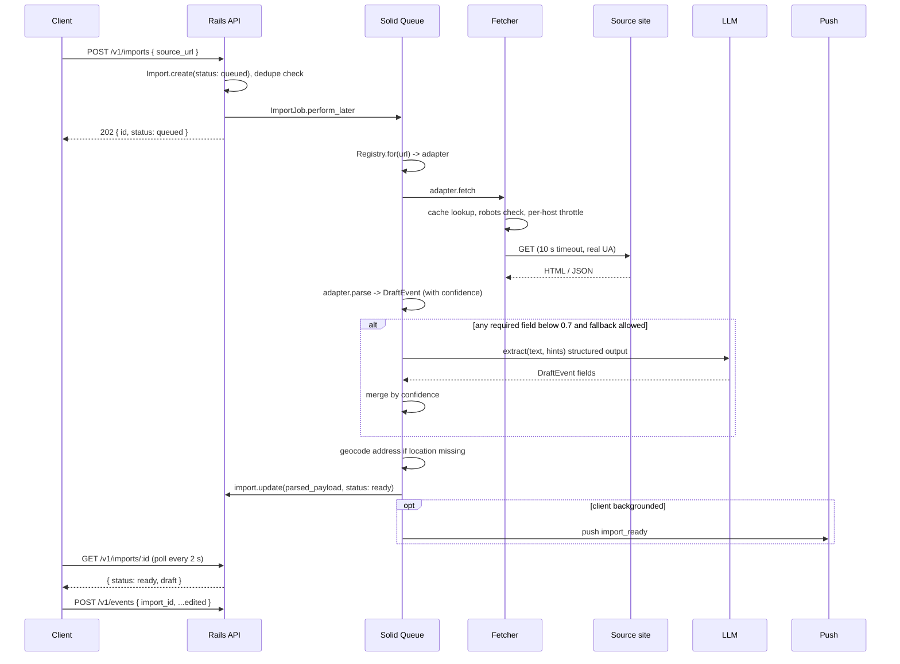

# Importer Pipeline

Status: planning draft, 2026-09-05. Detail for `architecture.md` section 3.7 and ADR 0007.

## Goal

A user pastes a link (or shares one from another app, or photographs a flyer) and gets a mostly filled event form within a few seconds. The user reviews, fixes low-confidence fields, and publishes. The original link is preserved on the event so the app links out rather than replacing the source community.

Evite is the first adapter because that is what Amir's local meets use today. Everything else is ordered by expected usage in coastal Orange County and the Inland Empire: Instagram posts, flyers, Eventbrite, Meetup, Partiful.

## Pipeline

## Components

### Import model

See `data-model.md`. Status transitions: `queued -> fetching -> parsing -> extracting? -> ready | failed`, then `ready -> published` when an event is created from it. A `failed` import keeps `error_code` so the client can show a specific message ("This Evite is private. Ask the host to make it public, or enter the details manually.").

### Registry

Adapters register in a fixed list. `Registry.for(source)` returns the highest priority adapter whose `matches?(uri)` is true, falling back to `GenericOgAdapter`. Flyer imports (no URL) route directly to `FlyerOcrAdapter`.

### Fetcher

Faraday connection with middleware in this order: cache (Solid Cache, 6 h, keyed by normalized URL), per-host throttle (token bucket in Solid Cache), robots check, retry (2 attempts on 5xx and timeouts, none on 4xx), redirect following (max 5, same-site or known short-link hosts only), size limit (2 MB), timeout (10 s). User agent: `CurbSocialClubBot/1.0 (+https://curbsocial.club/bot)` (domain unconfirmed).

Robots policy: for adapters marked `user_initiated_single_fetch` (all launch adapters), the fetch is a single request for the exact URL the user pasted, which is the same thing a link preview does. We still read `robots.txt` and log disallowed hits so we can review, but we do not block Instagram and Partiful previews on that basis. No adapter ever crawls, paginates, or follows links beyond the pasted page and its `og:image`.

### Adapters

Each adapter implements `matches?`, `parse(fetched)`, and optionally overrides `fetch` (Eventbrite uses its API) and `llm_fallback_allowed?`.

| Adapter | Match | Primary extraction | Notes |
|---|---|---|---|
| `EviteAdapter` | `evite.com/event/*` | Embedded JSON state (`window.__INITIAL_STATE__` or equivalent), then schema.org, then visible text | Private invites return a login page; detect and fail with `login_required`. |
| `EventbriteAdapter` | `eventbrite.com/e/*` | Eventbrite API v3 with app token (event id from URL), fallback to JSON-LD | Most reliable source. |
| `MeetupAdapter` | `meetup.com/*/events/*` | JSON-LD `Event` in page | Recurring series are separate events on Meetup; we import one date. |
| `PartifulAdapter` | `partiful.com/e/*` | Next.js page data, OG tags | Markup churn expected; VCR cassettes refreshed quarterly. |
| `InstagramAdapter` | `instagram.com/p/*`, `/reel/*` | OG title, description (caption), image | Captions rarely contain structured dates, so LLM extraction is the normal path. Confidence capped at 0.8. |
| `FlyerOcrAdapter` | no URL, `flyer_blob_id` present | OCR text (client-provided from Apple Vision, else Google Vision on server) to LLM | Image also becomes the draft cover. |
| `GenericOgAdapter` | anything | JSON-LD `Event`, OpenGraph, `<title>`, `<h1>`, visible text | Always last. |

Facebook Events is deliberately absent: public event pages are login-walled for automated fetches. Users share a screenshot into the flyer path instead.

### DraftEvent and confidence

`Importers::DraftEvent` is an immutable `Data` object serialized to `parsed_payload`. Every field has a confidence in `confidence: { field => 0.0..1.0 }`.

| Source of a value | Confidence |
|---|---|
| API response or JSON-LD | 0.95 |
| Embedded page state | 0.9 |
| OpenGraph tag | 0.8 (title, image), 0.6 (description used as description) |
| Regex over visible text (dates, addresses) | 0.5 to 0.7 depending on pattern strictness |
| LLM extraction | model-reported confidence, capped at 0.85 |
| Geocoder result for address | 0.9 if single match with rooftop precision, 0.6 otherwise |

Required fields: `title`, `starts_at`, and either `location` or `address`. If any required field is missing or under 0.7 after the adapter runs, and `llm_fallback_allowed?` is true, the LLM extractor runs on the page's visible text plus any adapter hints (already-extracted values, page URL, today's date, likely timezone). The merge rule: adapter value wins when its confidence is at least 0.8; otherwise the LLM value wins when higher; ties keep the adapter value.

The client renders fields under 0.7 with an attention state so the user checks them before publishing. Publishing writes the final confidence map plus a `user_edited` list back onto the import for later analysis of adapter quality.

### LLM extractor

One provider behind an `Importers::LlmExtractor` interface with a JSON schema for structured output (title, description, start, end, timezone, recurrence hint, venue name, address, host name). Prompt includes the current date and the default region (Southern California) to disambiguate "Sat 7am". Temperature 0. Input truncated to 8k tokens of visible text. Cost is bounded by the per-user import limit (20 per hour) and the fetch cache. Provider choice (Anthropic, OpenAI, or a local model later) is a config value, not an architecture decision.

### Geocoding

If the draft has an address but no coordinates, `Geocoder` (the `geocoder` gem) queries Apple MapKit Server API first (free tier is generous) with Google Geocoding as fallback, caches results in Solid Cache for 30 days, and dedupes against existing venues within 100 m by name similarity (`pg_trgm`). Venue matching is suggested, not automatic; the draft carries `venue_candidates` for the client to offer.

## Client behavior

Mobile: the share extension and the in-app paste field both call `POST /imports`, then navigate to the draft screen which polls `GET /imports/:id`. The screen shows a skeleton with the source's favicon and a progress label driven by `status`. On `ready` the form fills in with animated field reveals; on `failed` it shows the error-specific message and a manual form pre-filled with whatever was extracted.

Web: same flow at `/new` and `/imports/:id`.

Push: if the app is backgrounded for more than 5 seconds during an import, the job sends `import_ready` so the user can come back.

## Testing

Each adapter has VCR cassettes for at least three real public pages (recorded with PII scrubbed) and unit tests asserting the DraftEvent fields and confidences. A quarterly recurring job (`AdapterHealthCheckJob`) re-fetches one known public URL per adapter and reports to Sentry when parsing yields fewer fields than the cassette baseline, which is how we learn a site changed its markup.

## Future adapters

Facebook (if a compliant path appears), Luma, Posh, TikTok captions, iCal and `.ics` links (cheap, worth doing early), Google Calendar public links, and plain text paste (a group chat message pasted in goes straight to LLM extraction). The interface does not change for any of these.
